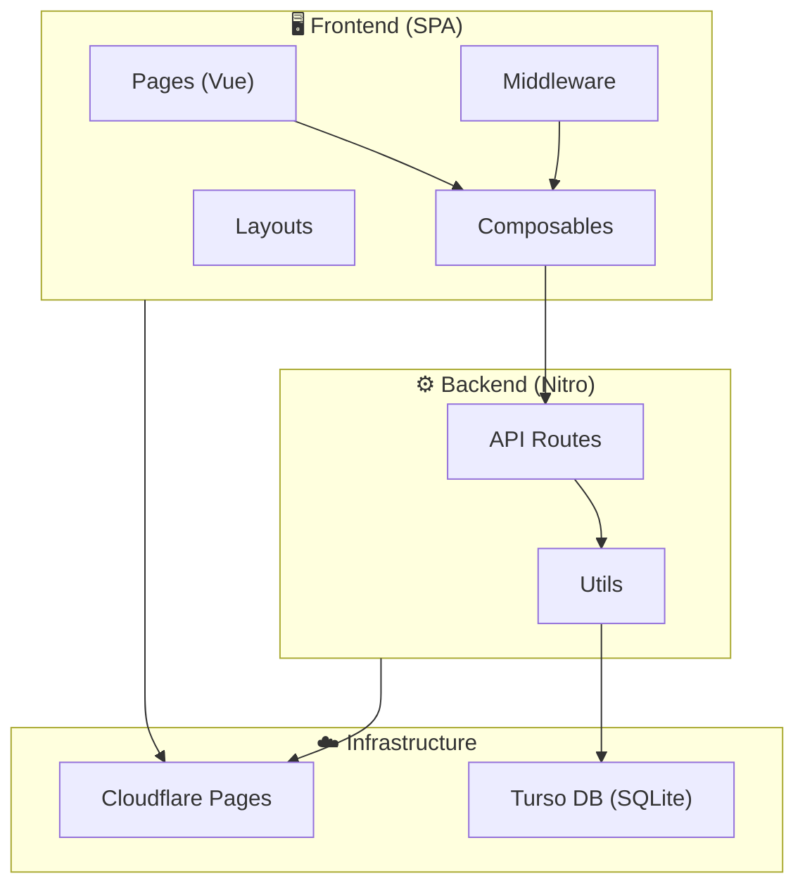

# Phân tích Kiến trúc — Chăm sóc Thành viên

> Phân tích bởi Software Architect — 25/02/2026

---

## 1. Tổng quan kiến trúc



| Layer | Tech | Vai trò |
|---|---|---|
| Frontend | Nuxt 4 (SPA) + PrimeVue + TailwindCSS | UI components, routing |
| Backend | Nitro (Cloudflare Pages preset) | API server, edge runtime |
| Database | Turso (libSQL) | SQLite-compatible, edge-ready |
| Auth | JWT (jose) + PBKDF2 (Web Crypto) | Stateless, edge-compatible |
| Deploy | Cloudflare Pages | Global edge network |

---

## 2. Đánh giá cấu trúc thư mục

### ✅ Điểm tốt

| Khía cạnh | Chi tiết |
|---|---|
| **Convention-based routing** | Nuxt file-based routing cho cả pages và API — dễ hiểu, ít config |
| **Tách biệt concerns** | `server/utils/` tách rõ: `db.ts` (data), `auth.ts` (security), `permissions.ts` (RBAC) |
| **RESTful API design** | URL patterns chuẩn REST: `GET /api/members`, `POST /api/members`, `PUT /api/members/:id` |
| **Composables pattern** | `useAuth`, `useApi`, `useLayout` — tái sử dụng logic tốt |
| **Edge-first** | Toàn bộ stack tương thích Cloudflare Workers: Web Crypto, jose, libSQL |
| **Global middleware** | `auth.global.ts` bảo vệ toàn bộ routes — không thể quên auth |

### Cây thư mục hiện tại

```
chamsochd/
├── app/
│   ├── composables/         ✅ 3 composables, gọn gàng
│   │   ├── useApi.ts
│   │   ├── useAuth.ts
│   │   └── useLayout.ts
│   ├── layouts/             ✅ Layout hệ thống rõ ràng
│   │   ├── AppLayout.vue
│   │   ├── AppMenu.vue
│   │   ├── AppMenuItem.vue
│   │   ├── AppSidebar.vue
│   │   ├── AppTopbar.vue
│   │   ├── AppFooter.vue
│   │   └── default.vue
│   ├── middleware/
│   │   └── auth.global.ts   ✅ Global auth guard
│   └── pages/               ✅ File-based routing
│       ├── index.vue         (Dashboard)
│       ├── login.vue
│       ├── members/
│       ├── events/
│       ├── groups/
│       ├── users/
│       └── follow-ups/
├── server/
│   ├── utils/               ✅ 3 utilities, tách biệt tốt
│   │   ├── db.ts
│   │   ├── auth.ts
│   │   └── permissions.ts
│   └── api/                  ✅ 29 routes, tổ chức theo resource
│       ├── auth/
│       ├── members/
│       ├── groups/
│       ├── care-notes/
│       ├── events/
│       ├── attendance/
│       ├── users/
│       ├── follow-ups/
│       ├── stats.get.ts
│       └── init.post.ts
└── docs/                     ✅ Tài liệu đặc tả + API reference
```

---

## 3. Các vấn đề cần cải thiện

### 🔴 Mức độ cao (Nên fix)

#### 3.1. DB Connection tạo mới mỗi request

```typescript
// server/utils/db.ts — Mỗi lần gọi useDB() tạo client MỚI
export function useDB(event: H3Event) {
    return createClient({
        url: config.tursoUrl,
        authToken: config.tursoToken
    })
}
```

> **Vấn đề:** Mỗi API call tạo 1 connection mới → overhead không cần thiết.
>
> **Đề xuất:** Cache client theo request hoặc dùng singleton (Turso HTTP client là stateless nên không critical, nhưng giảm overhead khởi tạo).

#### 3.2. SQL Injection qua string concatenation

```typescript
// Nhiều API routes xây SQL bằng cách nối chuỗi
sql += ` AND m.group_id IN (${placeholders})`
```

> **Đánh giá:** Code đã dùng **parameterized queries** (`args`) đúng cách — các `placeholders` chỉ là `?` nên **KHÔNG có SQL injection**. Tuy nhiên, pattern xây SQL bằng nối chuỗi dễ gây nhầm lẫn khi bảo trì.
>
> **Đề xuất:** Cân nhắc dùng query builder nhẹ hoặc tách thành helper functions.

#### 3.3. Thiếu Index trên database

```sql
-- init.post.ts không tạo INDEX
CREATE TABLE IF NOT EXISTS members (...)
CREATE TABLE IF NOT EXISTS care_notes (...)
```

> **Vấn đề:** Không có `CREATE INDEX` cho các cột thường query: `members.group_id`, `members.phone`, `care_notes.member_id`, `event_attendance.event_id`, `event_attendance.member_id`.
>
> **Ảnh hưởng:** Khi dữ liệu lớn (>1000 rows), các JOIN và WHERE sẽ chậm.
>
> **Đề xuất:** Thêm indexes vào `init.post.ts`.

#### 3.4. Không có DB Migration system

> Schema được định nghĩa trong `init.post.ts` bằng `CREATE TABLE IF NOT EXISTS`. Khi cần thay đổi schema (thêm cột, đổi kiểu), không có cơ chế migration.
>
> **Đề xuất:** Tạm chấp nhận cho v1.0 (quy mô nhỏ). Nếu scale, cần migration system.

---

### 🟡 Mức độ trung bình

#### 3.5. Pages quá phình (monolithic components)

| File | Lines | Vấn đề |
|---|---|---|
| `pages/members/[id].vue` | ~350+ | Chi tiết + 3 tabs + form chỉnh sửa + care notes + activity |
| `pages/events/[id].vue` | ~250+ | Chi tiết + điểm danh + tìm kiếm member |
| `pages/events/index.vue` | ~300+ | Danh sách + dialog tạo/sửa |
| `pages/users/index.vue` | ~300+ | CRUD Users + MultiSelect groups |

> **Đề xuất:** Tách các tab/section thành components riêng, ví dụ:
> ```
> components/
>   members/
>     MemberInfoTab.vue
>     MemberCareNotesTab.vue
>     MemberActivityTab.vue
>   events/
>     EventAttendancePanel.vue
>     EventFormDialog.vue
> ```

#### 3.6. Thiếu TypeScript interfaces/types

> Không có file `types/` chung. Các type được define inline hoặc dùng `any`. Frontend dùng `ref<any[]>()` nhiều nơi.
>
> **Đề xuất:** Tạo `types/` folder với interfaces cho Member, Group, Event, CareNote, User.

#### 3.7. Error handling không nhất quán

> Một số API routes trả `{ success: true }`, một số trả trực tiếp data. Không có format response chuẩn.
>
> **Đề xuất:** Chuẩn hóa response format, ví dụ: luôn trả `{ data, message }` hoặc `{ success, data }`.

#### 3.8. Duplicated logic giữa count query và filter query

```typescript
// members/index.get.ts — Logic filter bị lặp 2 lần
let sql = `SELECT m.* ... WHERE 1=1`
let countSql = `SELECT COUNT(*) ... WHERE 1=1`
// Cùng conditions được append 2 lần cho cả 2 queries
```

> **Đề xuất:** Tách filter conditions thành function riêng, tái sử dụng cho cả data query và count query.

---

### 🟢 Mức độ thấp (Nice to have)

#### 3.9. Thiếu validation layer

> Input validation nằm rải rác trong từng API route. Không có validation schema (Zod, Yup).
>
> **Đề xuất cho v2:** Dùng `zod` + `h3-zod` cho server-side validation.

#### 3.10. Thiếu rate limiting

> Các API auth không có rate limiting → có thể bị brute force.
>
> **Đề xuất:** Cloudflare Rate Limiting rules hoặc middleware.

#### 3.11. JWT token không có refresh mechanism

> Token hết hạn sau 7 ngày → user bị đăng xuất đột ngột.
>
> **Đề xuất:** Thêm refresh token hoặc silent refresh khi token sắp hết hạn.

---

## 4. Dependency Analysis

| Package | Purpose | Đánh giá |
|---|---|---|
| `nuxt ^4.2.2` | Framework | ✅ Latest stable |
| `primevue ^4.5.4` | UI Library | ✅ Active, phong phú components |
| `@libsql/client ^0.17` | Turso DB | ✅ Edge-compatible |
| `jose ^6.1.3` | JWT | ✅ Edge-compatible, lightweight |
| `tailwindcss-primeui` | Theme bridge | ✅ Kết nối TailwindCSS với PrimeVue |
| `wrangler ^4.68.1` | CF CLI | ⚠️ Nên là devDependency |
| `@primeuix/themes` | Themes | ⚠️ Có thể không cần (đã có `@primevue/themes`) |

> **Nhận xét:** Dependencies gọn, không bloat. Toàn bộ tương thích edge runtime.

---

## 5. Security Assessment

| Aspect | Status | Chi tiết |
|---|---|:---:|
| Authentication | ✅ | JWT + PBKDF2, edge-compatible |
| Authorization (RBAC) | ✅ | 3-level roles + group-level access |
| SQL Injection | ✅ | Parameterized queries throughout |
| XSS | ✅ | Vue.js auto-escapes by default |
| CSRF | ⚠️ | SPA + Bearer token nên low risk, nhưng không có explicit CSRF protection |
| Password storage | ✅ | PBKDF2 100K iterations |
| Secret management | ✅ | Runtime config + env vars |
| Init endpoint | ⚠️ | Protected by secret key, nhưng vẫn accessible — nên disable sau khi init |

---

## 6. Scalability Assessment

| Yếu tố | Hiện tại | Giới hạn | Khuyến nghị |
|---|---|---|---|
| Users đồng thời | ✅ OK | ~100 concurrent | Cloudflare scale tự động |
| DB rows | ⚠️ | >5K rows cần index | Thêm indexes |
| File upload | ❌ Chưa có | — | Cần R2 storage cho ảnh |
| Caching | ❌ Chưa có | — | Response caching cho stats |
| Realtime | ❌ Chưa có | — | Không cần cho v1.0 |

---

## 7. Điểm số tổng kết

| Tiêu chí | Điểm (1–10) | Ghi chú |
|---|:---:|---|
| **Cấu trúc thư mục** | 8/10 | Rõ ràng, theo convention Nuxt |
| **Tách biệt concerns** | 7/10 | Backend tốt; Frontend pages hơi phình |
| **Security** | 8/10 | Solid cho quy mô hiện tại |
| **Code quality** | 7/10 | Thiếu types, có code duplication nhẹ |
| **Scalability** | 6/10 | Cần indexes và caching cho scale |
| **Edge compatibility** | 9/10 | Toàn bộ stack edge-ready |
| **Documentation** | 8/10 | Đặc tả + API reference đầy đủ |
| **Maintainability** | 7/10 | Cần tách components và thêm types |

### **Tổng: 7.5/10** — Solid cho MVP/v1.0, cần refactor nhẹ khi scale.

---

## 8. Roadmap cải thiện đề xuất

### Phase 1 — Quick wins (ngay)
- [ ] Thêm DB indexes vào `init.post.ts`
- [ ] Move `wrangler` sang devDependencies
- [ ] Loại bỏ package `@primeuix/themes` nếu không dùng

### Phase 2 — Code quality (v1.1)
- [ ] Tạo `types/` folder với shared interfaces
- [ ] Tách large pages thành components
- [ ] Chuẩn hóa API response format
- [ ] Tách filter logic thành helper function (giảm duplication)

### Phase 3 — Scale-ready (v2.0)
- [ ] DB migration system
- [ ] Input validation (Zod)
- [ ] Response caching
- [ ] Rate limiting
- [ ] Silent token refresh
